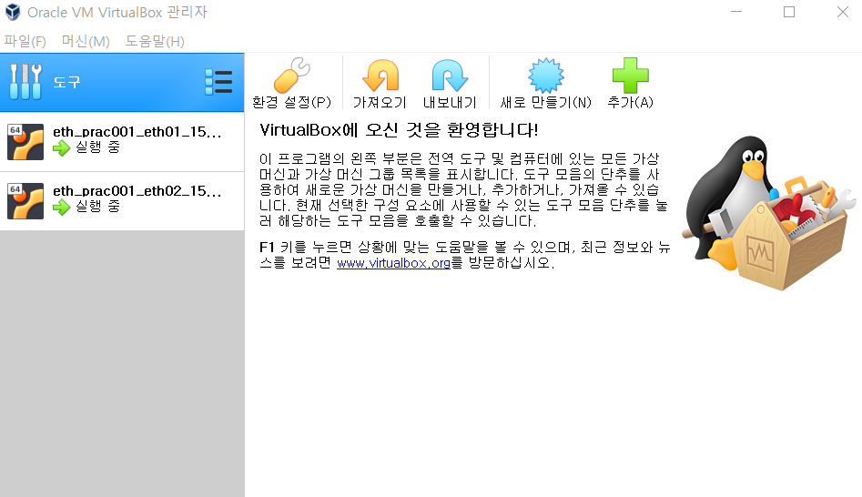
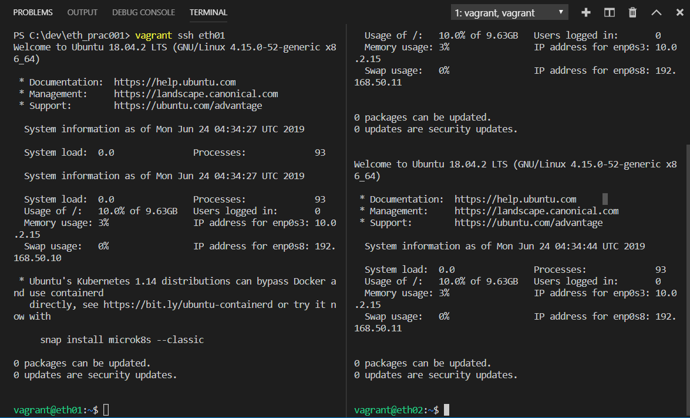

참조 : https://github.com/ldh1428a/ssafy

# 블록체인 실습1

## 1. 환경 세팅

### 1.1 설치

1. virtualBox
2. Vagrant
3. vscode

### 1.2 기본설정

- 실습을 위한 로컬 디렉토리 설정
  
- workspace > C:\dev\eth_prac001
  
- 가상머신 생성

  - vscode 실행 후 workspace 에서 ctrl + ` 으로 terminal 실행

  - Terminal에서

    ```
    $ vagrant init
    ```

  - Vagrantfile 파일이 생성되었을 것이다. vargrantfile을 수정해야 한다. (이렇게 바꾸자.)

    ```
    Vagrant.configure("2") do |config|
      config.vm.define "eth01" do |eth01|
        eth01.vm.box = "ubuntu/bionic64"
        eth01.vm.hostname = "eth01"
        eth01.vm.network "private_network", ip: "192.168.50.10"
        eth01.vm.provider "virtualbox" do |eth01v|
          eth01v.memory = 4096
        end
      end
      config.vm.define "eth02" do |eth02|
        eth02.vm.box = "ubuntu/bionic64"
        eth02.vm.hostname = "eth02"
        eth02.vm.network "private_network", ip: "192.168.50.11"
        eth02.vm.provider "virtualbox" do |eth02v|
          eth02v.memory = 4096
        end
      end
    end
    ```

  - 위에서 나온 IP 주소는 가상 환경에서 사용할 IP 주소이다.

  - 참고사이트 : <https://github.com/lkitty0302/ssafy/blob/master/example/geth/Vagrant.txt>

## 2. virtualbox 구동 및 가상머신 접속

### 2.1 virtualbox 구동하기

terminal 하나로만 하자.(eth01, eth02 두 개 동시에 하지 말자)

- eth01 이라는 가상 머신 실행

  ```
  $ vagrant up eth01
  $ vagrant up eth02
  ```

- 동시에 실행한 경우 오류 해결 방법

  - .vagrant.d  폴더 삭제 후 위 명령어 다시 실행

  - 위치 : `C:\Users\multicampus\.vagrant.d`

- 실행 이후에는 Oracle VM VirtualBox 관리자에 아래와 같은상태 확인 가능

  

### 2.2 가상머신 접속

- 별도의 terminal에서 각 각 접속

  ```
  $ vagrant ssh eth01
  $ vagrant ssh eth02
  ```

  실행 이후 아래와 같은 화면

  

- 각 terminal에서 추가설치할 예정입니다. (이건 동시진행 가능)

  ```
  $ sudo apt-get update
  $ sudo apt-get install software-properties-common
  $ sudo add-apt-repository -y ppa:ethereum/ethereum
  $ sudo apt-get install ethereum 
  # 맨 아래 명령어는 중간에 y 입력해야합니다.
  
  # 아래는 설치확인 코드입니다.
  $ geth version
  
  ''' 아래가 출력될 것입니다.
  Geth
  Version: 1.8.27-stable
  Git Commit: 4bcc0a37ab70cb79b16893556cffdaad6974e7d8
  Architecture: amd64
  Protocol Versions: [63 62]
  Network Id: 1
  Go Version: go1.10.4
  Operating System: linux
  GOPATH=
  GOROOT=/usr/lib/go-1.10
  '''
  ```


## 3. 디렉토리 관련 + Geth 초기화/구동

### 3.1 디렉토리 관련

- eth01 가상머신에서 수행

  ```
  vagrant@eth01:~$ mkdir -p dev/eth_localdata
  vagrant@eth01:~$ mkdir -p dev/eth_localdata
  vagrant@eth01:~/dev/eth_localdata$ vi CustomGenesis.json
  
  '''
  insert 모드에서
  아래 내용 복붙합시다. nano 로도 .json 데이터를 넣을 수 있다고 합니다.
  
  
  {
    "config": {
      "chainId": 921,
      "homesteadBlock": 0,
      "eip155Block": 0,
      "eip158Block": 0
    },
    "alloc": {},
    "coinbase": "0x0000000000000000000000000000000000000000",
    "difficulty": "0x20",
    "extraData": "",
    "gasLimit": "0x47e7c5",
    "nonce": "0x0000000000000042",
    "mixhash": "0x0000000000000000000000000000000000000000000000000000000000000000",
    "parentHash": "0x0000000000000000000000000000000000000000000000000000000000000000",
    "timestamp": "0x00"
   }
   
  그 다음에 
  esc 후 
  :wq 
  '''
  
  참조 : (https://github.com/lkitty0302/ssafy/blob/master/example/geth/CustomGenesis.json)
  1. "nonce": "0x0x0000000000000042" 가 아니라
  	"nonce": "0x0000000000000042" 입니다. 수정 확인바랍니다.
  2. " 잘 확인하자. ex) 다른 큰 따옴표 있을 수 있다. parentHash 쪽에;;
  
  ```

### 3.2 초기화 및 구동

#### (exit로 나가고 구동으로 가상머신으로 들어옴.)

- Geth 초기화

  ```
  $ geth --datadir /home/vagrant/dev/eth_localdata init /home/vagrant/dev/eth_localdata/CustomGenesis.json
  ```

- Geth 구동 ( 두 개 port 자기의 것으로~)

  ```
  $ geth --networkid 921 --maxpeers 2 --datadir /home/vagrant/dev/eth_localdata --port 30303 console
  
  $ geth --networkid 921 --maxpeers 2 --datadir /home/vagrant/dev/eth_localdata --port 30304 console
  ```

  

- 노드 연결 ( 노드 연결은 서로 엇갈리게)

  = addPeer 할 때 서로 엇갈리게 하라는 말입니다.

  ```
  1 번에서 나온 값은
  >admin.nodeInfo.enode
  "enode://75f57330551aa1bb3bee70f3ee4da2a2bfdbef1a78b1ad495a3ecb08b2ddc878bb655ea56ac23ac863f48cc0af72571a06e379b9fb39dedcdbda57eb77b884b8@127.0.0.1:30304"
  
  
  terminal 2에서 넣고~~
  >admin.addPeer("enode://75f57330551aa1bb3bee70f3ee4da2a2bfdbef1a78b1ad495a3ecb08b2ddc878bb655ea56ac23ac863f48cc0af72571a06e379b9fb39dedcdbda57eb77b884b8@192.168.50.10:30304")
  >admin.peers
  [{
      caps: ["eth/63"],
      enode: "enode://75f57330551aa1bb3bee70f3ee4da2a2bfdbef1a78b1ad495a3ecb08b2ddc878bb655ea56ac23ac863f48cc0af72571a06e379b9fb39dedcdbda57eb77b884b8@192.168.50.10:30303",
      id: "fc4979a6dd9d2e9e1ad2e12ac754f456ba84cb0f2026ffa61b3247092dae15d6",
      name: "Geth/v1.8.27-stable-4bcc0a37/linux-amd64/go1.10.4",
      network: {
        inbound: false,
        localAddress: "192.168.50.11:41684",
        remoteAddress: "192.168.50.10:30303",
        static: true,
        trusted: false
      },
      protocols: {
        eth: {
          difficulty: 32,
          head: "0x39f8fb70aee770c3481a4d2099499e1ed02db3f545b57d493bb360e05ab1176e",
          version: 63
        }
      }
  }]
  
  
  이런 식으로 나옴
  ```


## 4. 계정의 생성 및 확인

- 이더리움 계정(EOA) 생성 (저는 eth02 에서 했습니다.)

  ```
  > personal.newAccount("test1234")
  "0xe3bd3e3477ae3df253ab008d05593c2ff004f7f8"
  
  > personal.newAccount("test12345")
  "0x66e50b3d393590836bde4d1eb72401ff78b033b3"
  ```

- eth02 가상머신 / Geth console 확인

  ```
  > eth.accounts
  ["0xe3bd3e3477ae3df253ab008d05593c2ff004f7f8"]
  
  >eth.getBalance("0xe3bd3e3477ae3df253ab008d05593c2ff004f7f8") 하면 475000000000000 나옴 (채굴량 ㅇㅇ)
  ```

- eth01 에서 받기 위해서 생성하였다.

  ```
  > personal.newAccount("test2345")
  "0xcee5c669705cabf82e43826a6afb275d02b98cb0"
  
  eth.getBalance("0xcee5c669705cabf82e43826a6afb275d02b98cb0") 하면 00000000000 나오는 상태
  ```


## 5. 트랜잭션 생성

```
# 각 가상머신마다 만든 계좌(계정)목록입니다.
# eth01
test2345 : "0xcee5c669705cabf82e43826a6afb275d02b98cb0"

# eth02
test1234 : "0xe3bd3e3477ae3df253ab008d05593c2ff004f7f8"
test12345 :"0x66e50b3d393590836bde4d1eb72401ff78b033b3"


```


- eth01 가상머신에서 채굴하는 것 ( 상태입니다.)

  ```
  >miner.start(1)
  >miner.stop() # 이건 멈추는 것
  >eth.getBalance("0xe3bd3e3477ae3df253ab008d05593c2ff004f7f8") # 이걸로 실시간 채굴량 확인 가능. 단위는 으어어..
  ```

  

  - 솔직히 여기서부터 확실하지 않은 코드들입니다..ㅅ.ㅣ무룩..

  ```
  web3.personal.unlockAccount(eth.coinbase, "0xe3bd3e3477ae3df253ab008d05593c2ff004f7f8") 
  비밀번호는 AccountsName 그대로 입력 / test1234 입력
  ```

- 보내는 방법 ( 이건 아직... )

  ```
  >eth.sendTransaction({from: eth.accounts[0], to: eth.accounts[1], value: web3.toWei(10, "ether")})
  ```

- ```
  eth.getTransaction("txhash")
  ```


# 블록체인 실습2 Remix

```
# EscrowTest.sol

pragma solidity >=0.4.22 <0.6.0;
contract EscrowTest {
    uint public value;
    
    address payable public seller;
    address payable public buyer;
    
    enum State{Create, Locked, Sent, Complete}
    
    State public state;
    
    mapping(address=> uint) balanceOf;
    
    function registorItem(uint amount_) public{
        seller = msg.sender;
        state = State.Create;
        value = amount_;
        
    }
    function buyItem() public payable{

        buyer = msg.sender;
        balanceOf[seller] += value;
        state = State.Locked;
    }
    function refund() public{
        require(state == State.Locked, "state is not locked");
        balanceOf[seller] -= value;
        selfdestruct(buyer);
        state = State.Create;
    }
    function confirmItem() public{
        require(buyer == msg.sender, "you are not buyer");
        require(state == State.Sent, "state is not sent");
        selfdestruct(seller);
        state = State.Complete;
    }
    function sendItem() public{
        require(seller == msg.sender, "you are not sender");
        require(state == State.Locked, "state is not locked");
        state = State.Sent;
        
    }
    
}


```

compile .sol 이후
적절한 value를 넣은 이후(ex, 2 wei )
address : 0x7483c7fec930d42e8177f64840bd162530df48e0
누른 다음
buyItem 하고 하면..승인나면 성공

